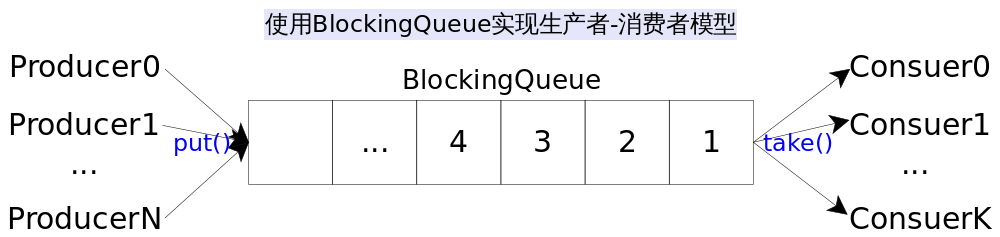

# Concurrent Collections(I)

生产者-消费者模型最简单的实现方式是什么？使用Java语言中的`BlockingQueue`是最简单有效的实现方式。本节我们将对Java并发容器给出介绍，完成我们在[《深入理解Java集合框架》](https://github.com/CarpenterLee/JCFInternals)系列文章中未竟的内容。

## BlockingQueue

`BlockingQueue`是一个阻塞队列接口，所谓阻塞队列就是在添加元素或获取元素时，线程会阻塞等待直到队列不满或者非空。该接口常见实现类有`ArrayBlockingQueue`，`LinkedBlockingQueue`和`PriorityBlockingQueue`等，前两个分别是依靠数组和链表实现的阻塞队列，后一个是阻塞的优先队列。关于[数组](https://github.com/CarpenterLee/JCFInternals/blob/master/markdown/2-ArrayList.md)、[链表](https://github.com/CarpenterLee/JCFInternals/blob/master/markdown/3-LinkedList.md)以及[优先队列](https://github.com/CarpenterLee/JCFInternals/blob/master/markdown/8-PriorityQueue.md)数据结构方面的知识，[《深入理解Java集合框架》](https://github.com/CarpenterLee/JCFInternals)系列文章已经讲解的非常清楚，不再重复。此处主要考察阻塞队列的特点和用法，阻塞队列常见的接口方法如下表，不同方法对特殊情况的处理方式不同：

<table width="600px"><tr><td></td><td>抛异常</td><td>返回特殊值</td><td>阻塞</td><td>阻塞直到超时</td></tr><tr><td>插入</td><td>add(e)</td><td>offer(e)</td><td>put(e)</td><td>offer(e, time, unit)</td></tr><tr><td>删除</td><td>remove()</td><td>poll()</td><td>take()</td><td>poll(time, unit)</td></tr><tr><td>查看头部</td><td>element()</td><td>peek()</td><td>无</td><td>无</td></tr><table>

上表中后两列方法使用较多，因为我们使用阻塞队列显然是想发挥其阻塞的特性。

BlockingQueue是线程安全的且不允许放入`null`值，常用于生产者-消费者模式的线程间数据共享。通常队列都会有一个固定大小，能够乘放指定个数个元素。当队列空间占满时，生产者将会挂起直到队列不满；当队列为空时，消费者将会挂起直到队列非空。一个简单而实用的例子如下：

```Java
// 使用BlockingQueue实现生产者-消费者模式
public class ProducerConsumer {
    public static void main(String[] args) {
        BlockingQueue<String> queue = new ArrayBlockingQueue<>(16);// 固定容量为16的阻塞队列
        new Producer<String>(queue).start();// Producer 0
        new Producer<String>(queue).start();// Producer 1
        new Consumer<String>(queue).start();// Consumer
    }
    static class Producer<E> extends Thread{
        private BlockingQueue<E> queue;
        public Producer(BlockingQueue<E> queue){ this.queue = queue; }
        @Override
        public void run(){//不停生产元素，添加到共享队列当中
            while(true){
                try {
                    E e = produce();
                    queue.put(e);// 挂起，直到队列非满
                } catch (InterruptedException e1) { /* exception */ }
            }
        }
        protected E produce(){return (E)String.valueOf(System.nanoTime());}
    }
    static class Consumer<E> extends Thread{
        private BlockingQueue<E> queue;
        public Consumer(BlockingQueue<E> queue){ this.queue = queue; }
        @Override
        public void run(){//不断从共享队列当中取出元素，并消费
            while(true){
                try {
                    E e = queue.take();// 挂起，直到队列非空
                    consume(e);
                } catch (InterruptedException e1) { /* exception */ }
            }
        }
        protected void consume(E e){System.out.println(e);}
    }
}
```

上述代码使用ArrayBlockingQueue作为共享队列，实现了生产者-消费者模式，并指定了两个生产者和一个消费者，现实场景中生产者和消费者的数量都是不确定的，可以是多个，也可以暂时是零个。上述代码的示意图如下：



## BlockingDeque

`BlockingDeque`是阻塞双端队列接口，所谓双端队列就是队列的首尾都可以添加或删除元素，这意味着双端队列既可以当作栈使用，也可以当作队列使用，`LinkedBlockingDeque`是该接口的唯一实现类。关于[双端队列接口介绍](https://github.com/CarpenterLee/JCFInternals/blob/master/markdown/4-Stack%20and%20Queue.md)可参考前文，跟阻塞队列类似，阻塞双端队列的方法也分为阻塞和非阻塞，具体[可参考JDK API](https://docs.oracle.com/javase/8/docs/api/java/util/concurrent/BlockingDeque.html)，这里比在列举。跟BlockingQueue类似，阻塞双端队列也不允许放入`null`值，常用于多线程之间共享数据，如果对应到生产者-消费者模式上，就是生产者和消费者都可以产生或者消费数据。

LinkedBlockqingDeque可以在构造是指定固定大小，如果没有指定，则默认大小为Integer.MAX_VALUE。

## ConcurrentLinkedQueue and ConcurrentLinkedDeque

`ConcurrentLinkedQueue`是线程安全的队列，`ConcurrentLinkedDeque`是线程安全的双端队列，关于[Queue和Deque的接口说明](https://github.com/CarpenterLee/JCFInternals/blob/master/markdown/4-Stack%20and%20Queue.md)前面已经讲的非常清楚，不再赘述。这两个类都是基于链表的，并且没有容量限制，不允许放入`null`值；这两个类的迭代器都是弱一致的(weakly consistent)，在迭代的过程中插入和删除元素并不会导致*ConcurrentModificationException*，并且插入和删除效果会直接体现在迭代器中。值得注意的是，跟大多数容器不同这两个类的size()操作并开销较大，因为需要遍历内部的所有元素（而不是通过一个计数器直接返回），由于遍历过程中也可能有元素的插入和删除操作，最后返回的大小不一定表示当前的实际大小。

## ConcurrentSkipListMap and ConcurrentSkipListSet

首先说明`ConcurrentSkipListSet`内部实现是对`ConcurrentSkipListMap`的包装，就像[参阅：HashSet和HashMap](https://github.com/CarpenterLee/JCFInternals/blob/master/markdown/6-HashSet%20and%20HashMap.md#hashset)的关系那样，所以这里只着重说一下ConcurrentSkipListMap是个什么东西。ConcurrentSkipListMap是一种基于跳表(skip list)的并发有序Map。跟[参阅：TreeMap](https://github.com/CarpenterLee/JCFInternals/blob/master/markdown/5-TreeSet%20and%20TreeMap.md)类似ConcurrentSkipListMap是按照key值有序的，但内部不是通过红黑树实现，而是通过跳表实现。如果你需要一个按照key值排序且线程安全的Map，相比使用`Collectoins.synchronizedMap(TreeMap)`，ConcurrentSkipListMap显然是最佳选择。

## ConcurrentHashMap

终于轮到大名鼎鼎的`ConcurrentHashMap`登场了，它是线程安全的HashMap，用法跟HashMap一样。其内部采用分块加锁的形式来提高并发度，实现的非常巧妙很值得深入学习，我们会专门花一解单独介绍它的具体实现，敬请期待！

## 总结

本文介绍了Java常见的并发容器，使用这些并发容器能够简化编程，同时保证程序效率，当需要使用并发容器时，应首先考虑这里列举的类，而不是使用`Collections.synchronizedXXX()`对非并发容器进行包装。