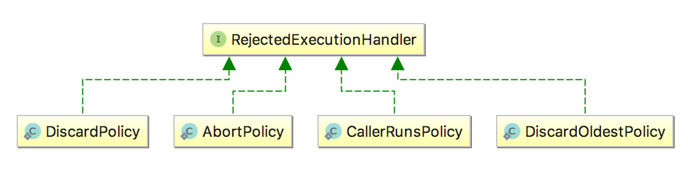
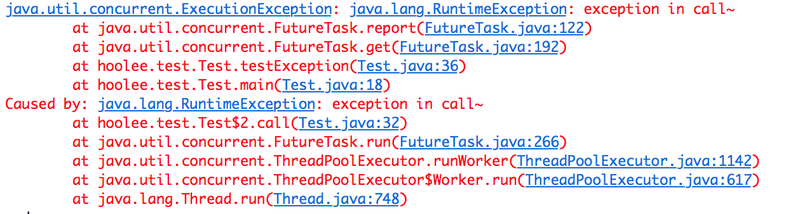

# ThreadPoolExecutor

构造一个线程池为什么需要几个参数？如果避免线程池出现OOM？`Runnable`和`Callable`的区别是什么？本文将对这些问题一一解答，同时还将给出使用线程池的常见场景和代码片段。

## 基础知识

### Executors创建线程池

Java中创建线程池很简单，只需要调用`Executors`中相应的便捷方法即可，比如`Executors.newFixedThreadPool(int nThreads)`，但是便捷不仅隐藏了复杂性，也为我们埋下了潜在的隐患（OOM，线程耗尽）。

`Executors`创建线程池便捷方法列表：

| 方法名| 功能 |
| -------- | -------- |
| newFixedThreadPool(int nThreads) | 创建固定大小的线程池 | 
| newSingleThreadExecutor() | 创建只有一个线程的线程池 | 
| newCachedThreadPool() | 创建一个不限线程数上限的线程池，任何提交的任务都将立即执行 | 

小程序使用这些快捷方法没什么问题，对于服务端需要长期运行的程序，创建线程池应该直接使用`ThreadPoolExecutor`的构造方法。没错，上述`Executors`方法创建的线程池就是`ThreadPoolExecutor`。

### ThreadPoolExecutor构造方法

`Executors`中创建线程池的快捷方法，实际上是调用了`ThreadPoolExecutor`的构造方法（定时任务使用的是`ScheduledThreadPoolExecutor`），该类构造方法参数列表如下：

```java
// Java线程池的完整构造函数
public ThreadPoolExecutor(
  int corePoolSize, // 线程池长期维持的线程数，即使线程处于Idle状态，也不会回收。
  int maximumPoolSize, // 线程数的上限
  long keepAliveTime, TimeUnit unit, // 超过corePoolSize的线程的idle时长，
                                     // 超过这个时间，多余的线程会被回收。
  BlockingQueue<Runnable> workQueue, // 任务的排队队列
  ThreadFactory threadFactory, // 新线程的产生方式
  RejectedExecutionHandler handler) // 拒绝策略
```

竟然有7个参数，很无奈，构造一个线程池确实需要这么多参数。这些参数中，比较容易引起问题的有`corePoolSize`, `maximumPoolSize`, `workQueue`以及`handler`：
- `corePoolSize`和`maximumPoolSize`设置不当会影响效率，甚至耗尽线程；
- `workQueue`设置不当容易导致OOM；
- `handler`设置不当会导致提交任务时抛出异常。

正确的参数设置方式会在下文给出。

### 线程池的工作顺序

> If fewer than corePoolSize threads are running, the Executor always prefers adding a new thread rather than queuing.
> If corePoolSize or more threads are running, the Executor always prefers queuing a request rather than adding a new thread.
> If a request cannot be queued, a new thread is created unless this would exceed maximumPoolSize, in which case, the task will be rejected.

corePoolSize -> 任务队列 -> maximumPoolSize -> 拒绝策略

### Runnable和Callable

可以向线程池提交的任务有两种：`Runnable`和`Callable`，二者的区别如下：

1. 方法签名不同，`void Runnable.run()`, `V Callable.call() throws Exception`
2. 是否允许有返回值，`Callable`允许有返回值
3. 是否允许抛出异常，`Callable`允许抛出异常。

`Callable`是JDK1.5时加入的接口，作为`Runnable`的一种补充，允许有返回值，允许抛出异常。

### 三种提交任务的方式：

| 提交方式 | 是否关心返回结果 |
| -------- | -------- |
| `Future<T> submit(Callable<T> task)` | 是 |
| `void execute(Runnable command)` | 否 | 
| `Future<?> submit(Runnable task)` | 否，虽然返回Future，但是其get()方法总是返回null |

## 如何正确使用线程池

### 避免使用无界队列
不要使用`Executors.newXXXThreadPool()`快捷方法创建线程池，因为这种方式会使用无界的任务队列，为避免OOM，我们应该使用`ThreadPoolExecutor`的构造方法手动指定队列的最大长度：
```java
ExecutorService executorService = new ThreadPoolExecutor(2, 2, 
				0, TimeUnit.SECONDS, 
				new ArrayBlockingQueue<>(512), // 使用有界队列，避免OOM
				new ThreadPoolExecutor.DiscardPolicy());
```

### 明确拒绝任务时的行为

任务队列总有占满的时候，这是再`submit()`提交新的任务会怎么样呢？`RejectedExecutionHandler`接口为我们提供了控制方式，接口定义如下：

```java
public interface RejectedExecutionHandler {
    void rejectedExecution(Runnable r, ThreadPoolExecutor executor);
}
```
线程池给我们提供了几种常见的拒绝策略：

</img>

| 拒绝策略 | 拒绝行为 |
| -------- | -------- |
| AbortPolicy | 抛出RejectedExecutionException     |
| DiscardPolicy | 什么也不做，直接忽略 | 
| DiscardOldestPolicy | 丢弃执行队列中最老的任务，尝试为当前提交的任务腾出位置 | 
| CallerRunsPolicy | 直接由提交任务者执行这个任务 | 

线程池默认的拒绝行为是`AbortPolicy`，也就是抛出`RejectedExecutionHandler`异常，该异常是非受检异常，很容易忘记捕获。如果不关心任务被拒绝的事件，可以将拒绝策略设置成`DiscardPolicy`，这样多余的任务会悄悄的被忽略。

```java
ExecutorService executorService = new ThreadPoolExecutor(2, 2, 
				0, TimeUnit.SECONDS, 
				new ArrayBlockingQueue<>(512), 
				new ThreadPoolExecutor.DiscardPolicy());// 指定拒绝策略
```

### 获取处理结果和异常

线程池的处理结果、以及处理过程中的异常都被包装到`Future`中，并在调用`Future.get()`方法时获取，执行过程中的异常会被包装成`ExecutionException`，`submit()`方法本身不会传递结果和任务执行过程中的异常。获取执行结果的代码可以这样写：

```Java
ExecutorService executorService = Executors.newFixedThreadPool(4);
Future<Object> future = executorService.submit(new Callable<Object>() {
        @Override
        public Object call() throws Exception {
            throw new RuntimeException("exception in call~");// 该异常会在调用Future.get()时传递给调用者
        }
    });
	
try {
  Object result = future.get();
} catch (InterruptedException e) {
  // interrupt
} catch (ExecutionException e) {
  // exception in Callable.call()
  e.printStackTrace();
}
```
上述代码输出类似如下：

</img>

## 线程池的常用场景

### 正确构造线程池

```java
int poolSize = Runtime.getRuntime().availableProcessors() * 2;
BlockingQueue<Runnable> queue = new ArrayBlockingQueue<>(512);
RejectedExecutionHandler policy = new ThreadPoolExecutor.DiscardPolicy();
executorService = new ThreadPoolExecutor(poolSize, poolSize,
    0, TimeUnit.SECONDS,
            queue,
            policy);
```

### 获取单个结果

过`submit()`向线程池提交任务后会返回一个`Future`，调用`V Future.get()`方法能够阻塞等待执行结果，`V get(long timeout, TimeUnit unit)`方法可以指定等待的超时时间。

### 获取多个结果

如果向线程池提交了多个任务，要获取这些任务的执行结果，可以依次调用`Future.get()`获得。但对于这种场景，我们更应该使用[ExecutorCompletionService](https://docs.oracle.com/javase/7/docs/api/java/util/concurrent/ExecutorCompletionService.html)，该类的`take()`方法总是阻塞等待某一个任务完成，然后返回该任务的`Future`对象。向`CompletionService`批量提交任务后，只需调用相同次数的`CompletionService.take()`方法，就能获取所有任务的执行结果，获取顺序是任意的，取决于任务的完成顺序：

```Java
void solve(Executor executor, Collection<Callable<Result>> solvers)
   throws InterruptedException, ExecutionException {
   
   CompletionService<Result> ecs = new ExecutorCompletionService<Result>(executor);// 构造器
   
   for (Callable<Result> s : solvers)// 提交所有任务
       ecs.submit(s);
	   
   int n = solvers.size();
   for (int i = 0; i < n; ++i) {// 获取每一个完成的任务
       Result r = ecs.take().get();
       if (r != null)
           use(r);
   }
}
```

### 单个任务的超时时间

`V Future.get(long timeout, TimeUnit unit)`方法可以指定等待的超时时间，超时未完成会抛出`TimeoutException`。

### 多个任务的超时时间

等待多个任务完成，并设置最大等待时间，可以通过[CountDownLatch](https://docs.oracle.com/javase/7/docs/api/java/util/concurrent/CountDownLatch.html)完成：

```Java
public void testLatch(ExecutorService executorService, List<Runnable> tasks) 
	throws InterruptedException{
      
    CountDownLatch latch = new CountDownLatch(tasks.size());
      for(Runnable r : tasks){
          executorService.submit(new Runnable() {
              @Override
              public void run() {
                  try{
                      r.run();
                  }finally {
                      latch.countDown();// countDown
                  }
              }
          });
      }
	  latch.await(10, TimeUnit.SECONDS); // 指定超时时间
  }
```

## 线程池和装修公司

以运营一家装修公司为例做个比喻。公司在办公地点等待客户来提交装修请求；公司有固定数量的正式工以维持运转；旺季业务较多时，会通过某些渠道（比如人才市场、熟人介绍等）雇佣一些临时工；淡季业务少时，老板会解雇一些游手好闲的临时工以减少开支；当生意太好，临时工也忙不过来的时候，新来的客户请求会被排期，接单后告诉用户一个月之后才能开始装修；如果排期太多，比如两年后的排期都满了，公司可能决定不再接收新的客户，直接拒单。

线程池就是程序中的“装修公司”，代劳各种脏活累活。上面的过程对应到线程池上：

```java
// Java线程池的完整构造函数
public ThreadPoolExecutor(
  int corePoolSize, // 正式工数量
  int maximumPoolSize, // 工人数量上限，包括正式工和临时工
  long keepAliveTime, TimeUnit unit, // 临时工游手好闲的最长时间，超过这个时间将被解雇
  BlockingQueue<Runnable> workQueue, // 排期队列
  ThreadFactory threadFactory, // 招人渠道
  RejectedExecutionHandler handler) // 拒单方式
```

## 总结

`Executors`为我们提供了构造线程池的便捷方法，对于服务器程序我们应该杜绝使用这些便捷方法，而是直接使用线程池`ThreadPoolExecutor`的构造方法，避免无界队列可能导致的OOM以及线程个数限制不当导致的线程数耗尽等问题。`ExecutorCompletionService`提供了等待所有任务执行结束的有效方式，如果要设置等待的超时时间，则可以通过`CountDownLatch`完成。

## 参考

[ThreadPoolExecutor API Doc](https://docs.oracle.com/javase/7/docs/api/java/util/concurrent/ThreadPoolExecutor.html)
